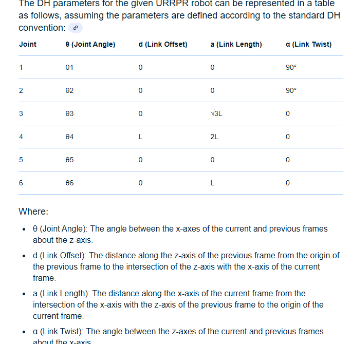
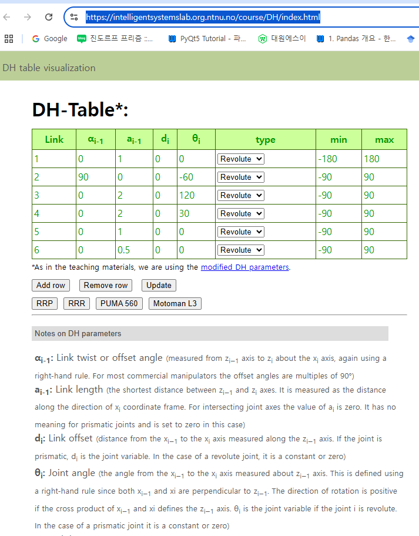

# 로봇팔의 DH 파라미터와 Zero Position 설명

## 1. DH 파라미터 표기법

DH(Denavit-Hartenberg) 파라미터는 로봇팔의 관절과 링크를 수학적으로 표현하는 표준 방법이다. 각 관절과 링크를 4개의 파라미터로 정의한다.

### DH 파라미터 4가지
 - θ (theta): 관절 각도 (회전 관절의 회전 각도)
 - d: 링크 오프셋 (관절 축을 따른 이동 거리, 직동 관절에서 주로 사용)
 - a: 링크 길이 (두 관절 축 사이의 공통 수직 거리)
 - α (alpha): 링크 비틀림 각 (두 관절 축 사이의 비틀림 각도)

### 설정 방법

 - $z_{i-1}$ : 이전 관절의 운동 축.
 - $x_i$ : $z_{i-1}$와 $z_i$를 연결하는 공통 수직선 방향.
 - $y_i$ : 오른손 법칙으로 $x_i$ 와 $z_i$에서 결정.

### 변환 행렬

$T_i^{i-1} =
\begin{bmatrix}
\cosθ_i & -\sinθ_i \cosα_i & \sinθ_i \sinα_i & a_i \cosθ_i \\
\sinθ_i & \cosθ_i \cosα_i & -\cosθ_i \sinα_i & a_i \sinθ_i \\
0 & \sinα_i & \cosα_i & d_i \\
0 & 0 & 0 & 1
\end{bmatrix}$

## 2. Classical DH vs Modified DH

### Classical DH
- 좌표계: 링크 끝 ($z_{i-1}$ 기준).
- 변환: $(i-1) → (i)$
- 파라미터
    - $θ_i$ : $x_{i-1}$에서 $x_i$로의 회전.
    - $d_i$ : $z_{i-1}$에 따른 거리
    - $a_i$ : 현재 링크 길이.
    - $α_i$ : 현재 비틀림 각.
 - 변환 행렬: 위와 동일.

### Modified DH
- 좌표계: 링크 시작 ($z_i$ 기준).
- 변환: $(i)$ → $i+1$
- 파라미터: 
   - $θ_i$ : $x_{i-1}$에서 $x_i$로의 회전.
   - $d_i$ : $z_i$에 따른 거리.
   - $a_{i-1}$ : 이전 링크 길이.
   - $α_{i-1}$ : 이전 비틀림 각.
   - 변환 행렬 :

$T_{i+1}^i = 
\begin{bmatrix}
\cosθ_i & -\sinθ_i & 0 & a_{i-1} \\
\sinθ_i \cosα_{i-1} & \cosθ_i \cosα_{i-1} & -\sinα_{i-1} & -d_i \sinα_{i-1} \\
\sinθ_i \sinα_{i-1} & \cosθ_i \sinα_{i-1} & \cosα_{i-1} & d_i \cosα_{i-1} \\
0 & 0 & 0 & 1
\end{bmatrix}$

### 차이점 요약
Classical: $a_i$, $α_i$ 가 현재 링크 기준. 좌표계는 링크 끝.
Modified: $a_{i-1}$, $α_{i-1}$가 이전 링크 기준. 좌표계는 링크 시작.

## 3. Zero Position
- 정의: 로봇의 모든 관절 변수($θ_i$, $d_i$)가 0인 기준 자세.
- 용도:kinematic 분석의 초기 상태.하드웨어/소프트웨어 초기화 기준.
- DH와의 관계:
  - Classical: $θ_i = 0$ 일 때 $x_{i-1}$ 와 $x_i$ 정렬.
  - Modified : $θ_i = 0$ 일 때 x$x_{i-1}$ 와 $x_i$가 $z_i$ 기준 정렬.
- 예시: 2자유도 로봇팔에서 $θ_1 = 0$ , $θ_2 = 0$ 이면 팔이 (x)-축을 따라 펴짐.

#### 실제 적용
제조사마다 정의 다를 수 있음 (예: 수직 자세, 완전히 펴진 상태 등).
안전성과 동작 계산의 기준점으로 사용.

