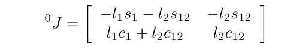
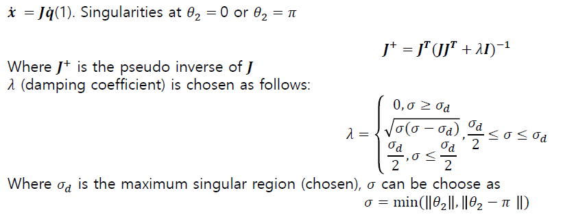

# Jacobian의 계산

교재의 내용을 따라, 다음과 같이 코드를 작성함. 


```matlab
function J = jacobian_2dof(theta1, theta2, L1, L2)
    J = [
        -L1*sin(theta1) - L2*sin(theta1 + theta2), -L2*sin(theta1 + theta2);
         L1*cos(theta1) + L2*cos(theta1 + theta2),  L2*cos(theta1 + theta2)
    ];
end

```
# damped pseudo-inverse Jacobian의 계산


```matlab
function J_damped_inv = damped_pseudoinverse(J, sigma, sigma_d)
    if sigma >= sigma_d
        lambda = 0;
    elseif sigma >= sigma_d/2
        lambda = sqrt(sigma * (sigma_d - sigma));
    else
        lambda = sigma_d/2;
    end
    
    % Pseudoinverse 계산
    I = eye(size(J,1));
    J_damped_inv = J' * inv(J*J' + (lambda)*I);
end


```
